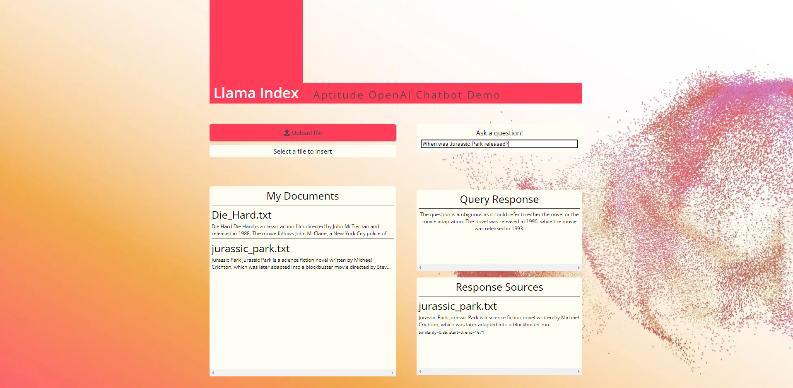

# Chatbot Example

This chatbot example is based on the [llama_index_starter_pack](https://github.com/logan-markewich/llama_index_starter_pack).

This repository provides a basic flask app and instructions on how to run it using Docker.

The basic demo includes the classic "Paul Graham Essay" from the original llama_index repo. Some good starting questions are

- What did the author do growing up?
- Tell me more about interleaf

However, once the app is up and running you'll be able to upload your files to the index for training.

## What is included?

There are two main example folders

- flask_react (runs three services on localhost:5601/5602/3000)

  - **flask_demo.py** - creates a simple api allowing the following
    - the "/query" endpoint accepts requests that contain a "text" parameter, which is used to query the index.
    - the "/upload" endpoint is a POST endpoint that inserts an attached text file into the index (the index is managed by a seperate server using locks, since inserting a document is a mutable operation and flask is multithreaded). You can use a tool like [Postman](https://www.postman.com/downloads/) to test the api - there are example screenshots using postman in the `postman_examples` folder.
  - react_frontend - A basic frontend using react, which calls the flask_api to insert, view, and query a GPTSimpleVectorIndex.

    

## Local Setup

### OpenAI API Key

- You will need an OpenAI API key and account to run this code. If you don't have one yet, get it by [signing up](https://platform.openai.com/overview). Then click your account icon on the top right of the screen and select `View API Keys`. Create an API key.
- Go into the `index_server.py` file and add you API key at the top. **Please note, this is for dev purposes only**

_Within the `index_server.py` you can also change the predicator model if you choose. It is currently using `gpt-3.5-turbo`_

### Code

I advise you use VS Code for this demo but you will require the following to be installed. Some are optional

- [Node](https://nodejs.org/en/download) - Required if you want to run the frontend outside of a Docker container.
- [Docker](https://docs.docker.com/get-docker/) - This will be used to containerise the server code and frontend into a single container. Ensure you have WSL 2.0 installed and enabled in the settings.
- [Anaconda Python](https://www.anaconda.com/) - This is optional as the Python code itself will be run inside of the docker container. However, if you want to create a Conda environment and install the requirements to run inside the IDE, then you will need this.
- VS Code Extensions -
  - [Docker](https://marketplace.visualstudio.com/items?itemName=ms-azuretools.vscode-docker) - This will make making changes to Dockerfiles easier in VS Code along with helping to create and manage containers.
  - [Python](https://marketplace.visualstudio.com/items?itemName=ms-python.python) - This will make things easier as it will help with IntelliSense, Formatting and linting in VS Code.

### Python Code

I found it much easier to make changes in VS code and build the docker images and containers as using Anaconda in VS Code can be troublesome. However, you want to use Conda environments, you need to ensure that your Python Interpreter Path in VS Code settings is configured to your Anaconda python.exe location. You may also need to install an additional Terminal for VS Code. If you are able to get up and running with this, you will be able to run the following in the terminal.

```
conda create --name llama_index python=3.11
pip install -r requirements.txt
```

If you manage to get the above code working in VS Code, let me know as I'd be keen to understand it.

### React Frontend

If you want to be able to run the frontend as a standalone outside of a Docker container, you can perform the following

- Open the VS code terminal
- cd into the react_frontend folder
- Install required node packages. Run the following:

  ```
  npm install
  ```

  This will install all application dependancies into the node_modules folder.

- Start the frontend application. Run the following:

  ```
  npm start
  ```

  This will start the application and launch it in the browser at localhost:3000. Please note that unless you have started the Python environment, the APIs will not work and you will only be able to change the frontend and not test the functionality.

## Docker

Docker makes everything a lot easier and allows you to spin up the full application (both server and client) inside a single Docker container.

This example contains a `Dockerfile`. The Docker file does the following

- Specifies the base image that will be used
- Installs all Python and Node packages
- Exposes the Ports to be used
- Runs the `launch_app.sh` command which completes the following
  - Indexes anything already in the documents folder. Don't worry if there is nothing, you can add to the index later.
  - Starts the Python Server
  - Builds and Servers the React Frontend

If you have Docker installed, you can do the following:

- Open VS Code Terminal
- cd into the `flask_react` folder. This is where the `Dockerfile` is located.
- Run the following code

  ```
  docker build -t {whatever name you want e.g. chatbot} .
  ```

  **The dot at the end of the command is needed and not a typo**

  This will build a python3.11-slim docker image inside your desired folder. It ends up being about 600MB-900MB depending on the example.

- _Optional_ - Once complete, you can list your images using the following command

  ```
  docker images
  ```

  This will list the image. Or, if you use the Docker Desktop UI, you will see it available. You will also be able to see if in VS Code Docker extension if you installed it.

- Now that the image is built. You can launch the container for the image. To do this, you will need to run the following

  ```
  docker run -d -p 3000:3000 -p 5601:5601 -p 5602:5602 {whatever name you gave to your image e.g. Chatbot}
  ```

  The `-d` parameter means that the container will launch in detached mode. This essentially means that you won't see any of the logs in the VS Code terminal but you can go to Docker Desktop to view these and the current status of the container spinning up. If you want to see the logs in the VS Code terminal, just remove the `-d` parameter.

  **The ports are important so that the host along with the services can access one and other**

  Once Docker has launched the container, you will be able to navigate to localhost:3000 for the frontend application and the APIs will work as the server has been started also.

  As the index function is triggered as the first step of spinning up the container, there is a 60 second sleep within the function. This means that if you immediately go to localhost:3000 and don't see anything, just give it a minute.

## Docker Additional

- You can list Docker container information by running the following

  ```
  docker containers ls
  ```

  This will show any containers, the image being used and the status

- You can stop a Docker container by running the following:

  ```
  docker container stop {container id}
  ```

- You can start an existing container by running the following:

  ```
  docker container start {container id}
  ```

## Next

- Build out front end to store history of conversation
- Fix API so that multiple sources are returned
- Create API to change LLM predicator model and settings
- Use Docker Compose to split Server and Client into different containers
